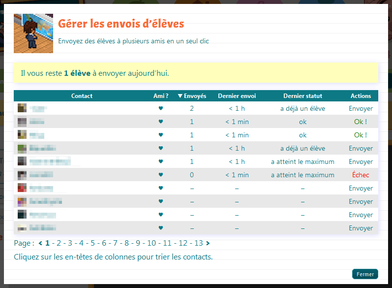

# Pupil Manager

*Un outil pour le jeu [Teacher Story](http://teacher-story.com)*

Ressentez la puissance de James Norray dans sa capacité, nouvellement acquise,
à expédier les élèves à la vitesse de la lumière !

## Installation

Assurez-vous que vous avez l'extension pour gérer les userscripts dans
votre navigateur.

* Pour Firefox c'est [Greasemonkey](https://addons.mozilla.org/en-US/firefox/addon/greasemonkey/)
* Pour Chrome c'est [Tampermonkey](https://chrome.google.com/webstore/detail/tampermonkey/dhdgffkkebhmkfjojejmpbldmpobfkfo)

Ensuite, suivez ce lien : [Pupil_Manager.user.js](https://raw.githubusercontent.com/Watilin/Pupil-Manager/master/Pupil_Manager.user.js)
Normalement votre monkey détecte le script et ouvre une fenêtre qui vous
propose de l'installer. Acceptez, le téléchargement et l'installation ne
prennent que quelques secondes.

Une fois le script installé, il ne vous reste plus qu'à vous rendre sur
Teacher Story (ou rafraîchir la page), et vous pourrez profiter de la
puissance de Pupil Manager.

## Fonctionnalités

* Liste des contacts
* Envoi en un clic

## À venir (très bientôt)

* Tri/recherche des contacts
* Statistiques d'envoi/réception d'élèves par contact
* Possibilité de définir une priorité des contacts
